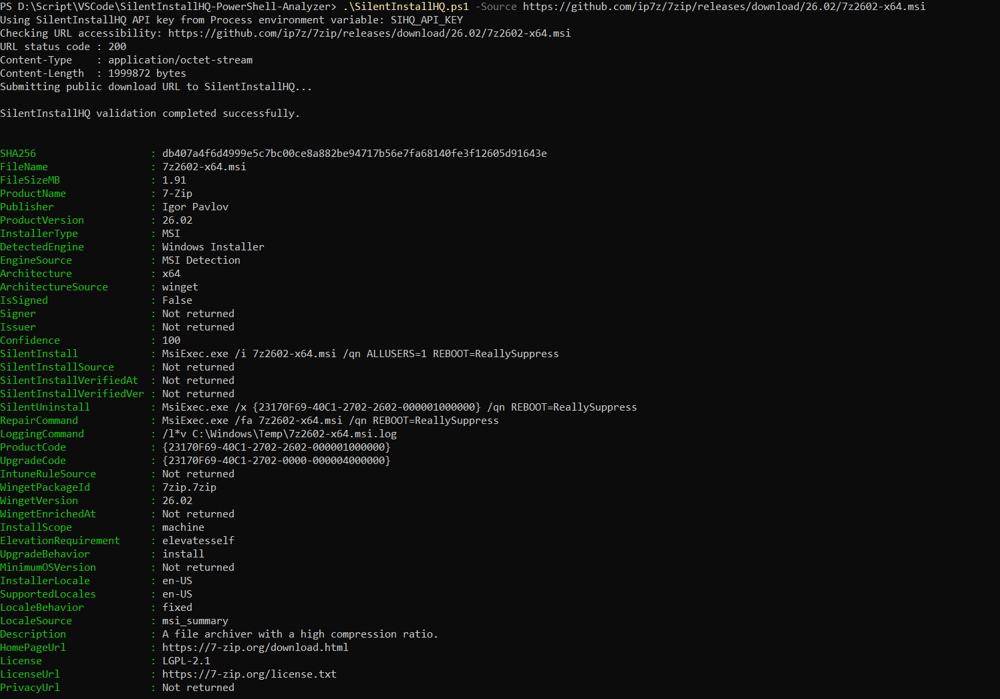
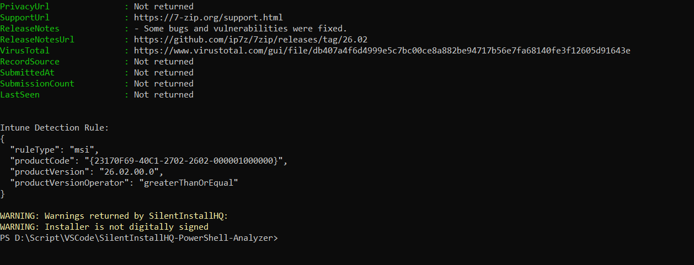
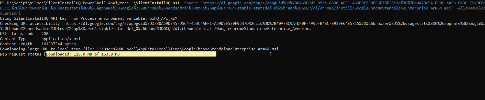
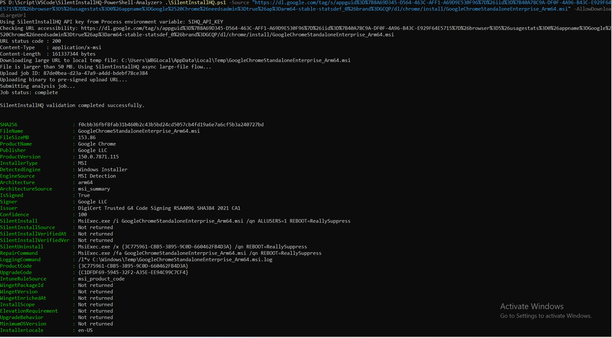
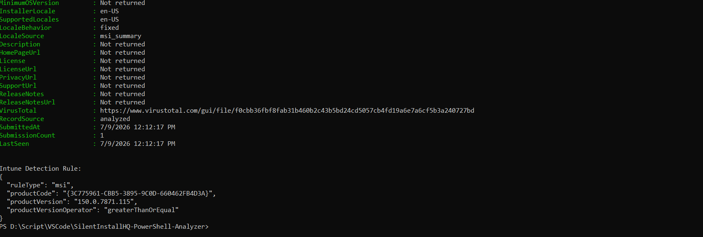

# SilentInstallHQ PowerShell CLI

A compact PowerShell CLI wrapper for the SilentInstallHQ API that analyzes Windows installer binaries or public installer URLs and produces a rich JSON profile useful for packaging engineers.

## Features

- Analyze local installer files or public HTTPS installer URLs
- Async large-file flow for files over 50 MB (pre-signed upload + job polling)
- Save full JSON profile to disk and print a human-readable summary
- Optional VirusTotal SHA256 lookup (queries existing VT report; does not upload files)
- Accepts explicit API keys or reads environment variables

## Requirements

- PowerShell 5.1 or newer (Windows PowerShell 5.1 and PowerShell 7+ are supported)
- Network access to the configured `BaseUrl` (default: https://app.silentinstallhq.com)

## Files

- Script: [SilentInstallHQ/SilentInstallHQ.ps1](SilentInstallHQ/SilentInstallHQ.ps1#L1)
- This README: [SilentInstallHQ/README.md](SilentInstallHQ/README.md#L1)

## Usage

Basic examples (run inside PowerShell 5.1+):

```powershell
# Analyze a public HTTPS installer URL and save profile
.\SilentInstallHQ.ps1 -Source "https://example.com/installer.msi" -OutFile "C:\Temp\installer-profile.json"

# Analyze a local MSI and print a summary
.\SilentInstallHQ.ps1 -Source "C:\Temp\MyApp.msi"

# Analyze and also check VirusTotal by SHA256 (requires VT API key via env or param)
.\SilentInstallHQ.ps1 -Source "C:\Temp\MyApp.msi" -CheckVirusTotal -VirusTotalApiKey "$env:VT_API_KEY"
```

### Example screenshots

These example images are saved in the `output/` folder and show the script producing analysis output for common installers.

#### 7-Zip example

Example command:

```powershell
.\SilentInstallHQ.ps1 -Source "C:\Temp\7z1900-x64.exe" -OutFile "C:\Temp\7zip-profile.json"
```





#### Google Chrome example

Example command:

```powershell
.\SilentInstallHQ.ps1 -Source "https://dl.google.com/chrome/install/ChromeStandaloneEnterprise64.msi" -OutFile "C:\Temp\chrome-profile.json"
```







### Important parameters

- `-Source` (required): HTTPS URL or local file path to analyze
- `-ApiKey`: SilentInstallHQ API key (or supply via env var names: `SIHQ_API_KEY`, `SILENTINSTALLHQ_API_KEY`, `SILENTINSTALLHQ_TOKEN`)
- `-OutFile`: Path to save the full JSON profile
- `-AllowDownloadLargeUrl`: When analyzing a remote URL larger than 50 MB, download locally and use the async upload flow
- `-SkipUrlPreCheck`: Skip HEAD pre-checks and submit URL directly
- `-PollIntervalSeconds`, `-PollTimeoutMinutes`: Job polling settings for large-file async flow
- `-CheckVirusTotal`: Query VirusTotal for the profile's SHA256
- `-VirusTotalApiKey`: VirusTotal API key (or supply via env var names: `VT_API_KEY`, `VIRUSTOTAL_API_KEY`, `VIRUSTOTAL_TOKEN`)

## Notes & Privacy

- The script never uploads files to VirusTotal — VirusTotal checks are performed by querying an existing VT file report by SHA256.
- Large-file analysis uses a pre-signed upload URL from SilentInstallHQ and will upload the binary to that destination as part of the async flow. Review and trust the destination before uploading sensitive binaries.

## Inspiration

This tool is inspired by the Silent Install HQ site and their new app that provides an API to access Windows setup/installer information for packaging engineers and to surface VirusTotal information for binaries.

## License

Add a license of your choice (for example, MIT) to the repository.
